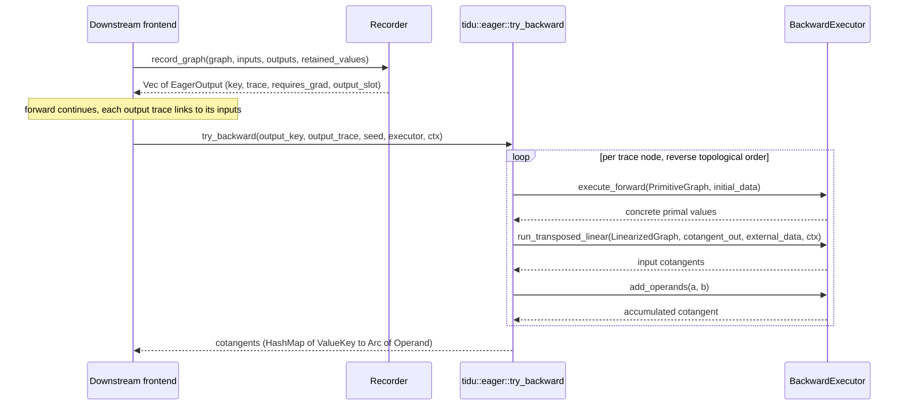

# Eager Integration

`tidu::eager` is for downstream frontends that execute operations immediately
and want a reverse-mode `backward()` workflow.

## Recording

Use `Recorder` to record each eager graph invocation. A single primitive eager
operation is represented as a one-operation `RecordedGraph`; composite eager
operations can record a larger primitive graph as one tape node. Each input is
described with `EagerInput`:

- `key` is the user-visible value key used for cotangent accumulation.
- `trace` points to the graph invocation that produced the value, if any.
- `requires_grad` controls whether cotangents should flow through the value.
- `data` stores concrete primal data for later replay.

`Recorder::record_graph` returns one `EagerOutput` per recorded graph output.

## Backward Execution

The downstream runtime implements `BackwardExecutor`.

`tidu` calls it to:

- replay concrete primal values for a primitive graph,
- run a transposed linear graph with cotangent seeds,
- add concrete cotangents when multiple paths meet.

The downstream runtime still owns tensor allocation, gradient storage, device
selection, shape metadata, and user-facing error reporting.

## The Backward Call Sequence

The sequence below runs from recording an invocation to producing cotangents.

1. The frontend records each invocation with `Recorder::record_graph`, which
   returns one `EagerOutput` per output. Each `EagerOutput` carries `key`,
   `trace`, `requires_grad`, and `output_slot` (the output's position within the
   recorded graph invocation).
2. To start reverse mode, the frontend calls
   `eager::try_backward(output_key, output_trace, seed, executor, ctx)`.
3. `try_backward` walks the trace in reverse topological order. For each node it
   linearizes and transposes the recorded graph, driving the downstream
   `BackwardExecutor`: `execute_forward` replays the primitive graph to recover
   concrete primal values, `run_transposed_linear` runs the transposed linear map
   with the incoming cotangents, and `add_operands` accumulates cotangents where
   multiple paths meet.
4. The result is a `HashMap<ValueKey, Arc<Operand>>` of cotangents for the inputs
   that required gradients.
