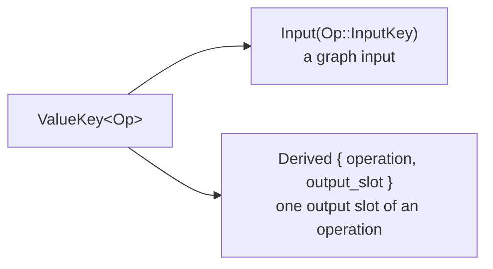
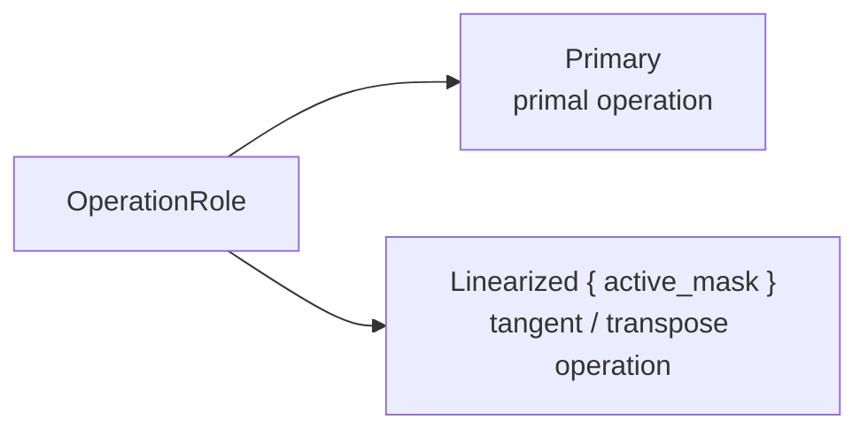

# Implementing Primitives

Downstream crates implement `tidu::Primitive` for their operation enum or
operation descriptor type.

## Operation Contract

A primitive operation must first implement `computegraph::GraphOperation`:

- `Operand` is the concrete value type used by the runtime.
- `Context` is runtime evaluation context.
- `InputKey` identifies graph inputs and must implement `tidu::ADKey`.
- `input_count` and `output_count` describe operation arity.

`tidu::Primitive` adds AD-specific requirements:

- `add()` returns the primitive used to accumulate cotangents.
- `jvp_rule()` emits tangent outputs for linearization.
- `transpose_rule()` emits input cotangents for transposed linear maps.
- `try_jvp_rule()` and `try_linear_transpose_rule()` can report missing rules
  with `ADRuleError`.

## Rule Closure

Rules emit primitive applications through `PrimitiveBuilder`. Every operation
that a rule emits must also be part of the same primitive set and must also have
the AD rules needed by later transforms.

For example, a multiply JVP usually emits multiply and add. That means multiply
and add must both be valid primitives in the downstream set.

## Active And Inactive Inputs

In rule signatures, `LocalValueId` is the graph-local identifier for a value
created while building the transformed primitive computation graph.

JVP rules receive `Option<LocalValueId>` tangent inputs. `None` means the
corresponding primal input is not active for the current transform. Rules should
avoid emitting work for inactive inputs.

Transpose rules receive optional output cotangents. If an output cotangent is
`None`, no cotangent flows through that output slot.

## Value Reference Model

AD rules describe new graph structure with two value kinds; choosing the right
one is the main subtlety when writing a rule.

- `PrimitiveValue::External(ValueKey)` references a value that already exists in
  the source primitive computation graph — a primal input or a primal output.
- `PrimitiveValue::Local(LocalValueId)` references a value the rule just produced
  through the builder during this transform.

`PrimitiveBuilder::add_primitive(op, inputs, role)` takes a
`Vec<PrimitiveValue>` and returns a `Vec<LocalValueId>` for the new operation's
outputs, which later calls feed back in as `Local(...)`.

A `ValueKey` is how a value keeps its identity across graph boundaries:

`LocalValueId` (a `usize`) is meaningful only within the single graph the builder
is constructing; `ValueKey` is stable across the primal graph and the graphs tidu
builds from it.

## Operation Roles

Every operation tidu emits carries an `OperationRole`, and `transpose_rule`
receives the role of the operation it is transposing.

- `OperationRole::Primary` marks a primal operation.
- `OperationRole::Linearized { active_mask }` marks an operation in a linearized
  (tangent) graph. `active_mask` is a `Vec<bool>` recording, per input, whether
  that input participates in the current transform — the same activeness that
  surfaces as `None` tangent/cotangent slots described above.

A JVP rule emits its tangent operations with `OperationRole::Linearized { .. }`;
a transpose rule reads the role to understand which linearized operation it is
differentiating.
