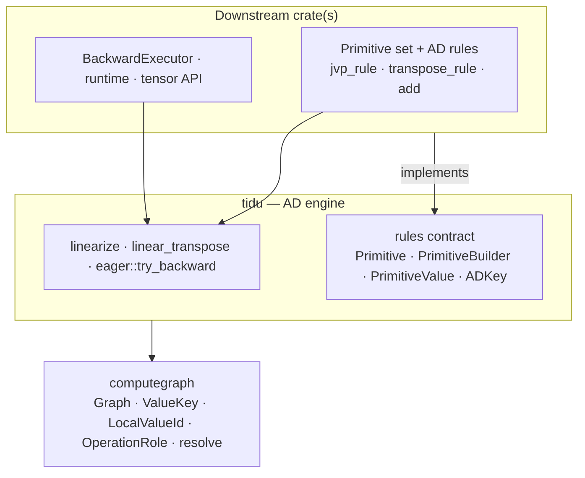
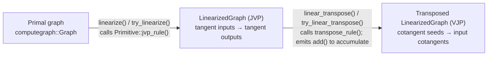
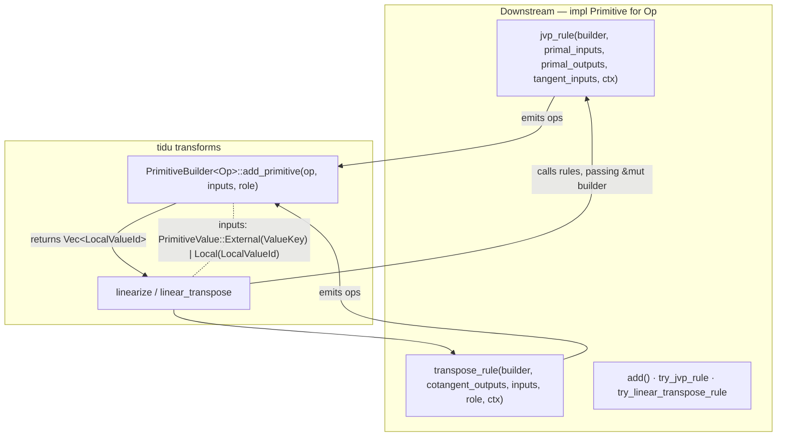
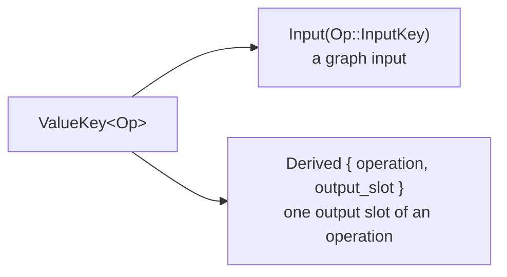
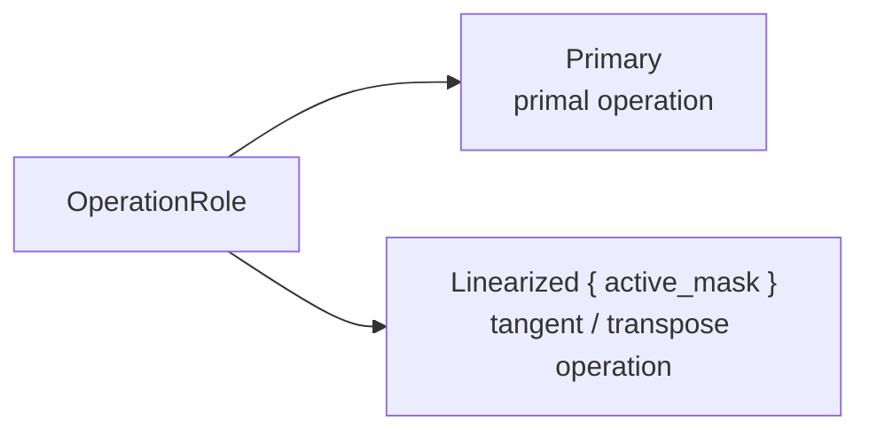
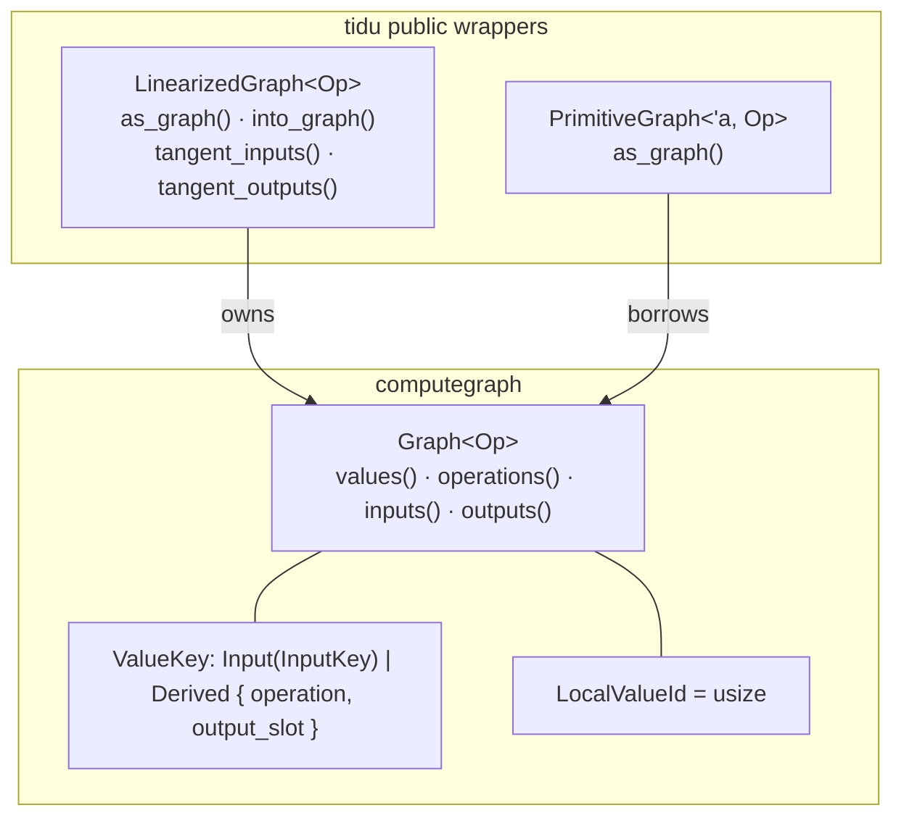

# tidu-rs Release-Quality Documentation Implementation Plan

> **For agentic workers:** REQUIRED SUB-SKILL: Use superpowers:subagent-driven-development (recommended) or superpowers:executing-plans to implement this plan task-by-task. Steps use checkbox (`- [ ]`) syntax for tracking.

**Goal:** Raise the tidu-rs documentation site to release quality by adding architecture diagrams, deepening thin concept pages, fixing front-door discoverability, and closing the API-map gap — without changing any `src/` API.

**Architecture:** Approach B (concepts hub). A new `docs/architecture/overview.md` carries the headline diagrams and the system mental model; the remaining diagrams and deep-concept prose go into their natural existing pages. All diagrams are Mermaid (Quarto renders them natively; CI builds the docs site on PRs).

**Tech Stack:** Quarto docs site (`docs/_quarto.yml`), Mermaid diagrams, rustdoc. Build: `bash scripts/build_docs_site.sh`. No code changes.

Design spec: `docs/superpowers/specs/2026-06-19-tidu-docs-release-design.md`.

## Global Constraints

- Docs-only change: do NOT modify any file under `src/`, `examples/`, or `Cargo.toml`.
- Docs in English (repo rule).
- Every API symbol named in a diagram or prose must match the verified signatures in this plan (names taken verbatim from `src/` and the pinned `computegraph` at rev `691def2`). Misnaming the API is a release blocker.
- All diagrams are fenced ```mermaid blocks (no committed SVGs, no external assets).
- `docs/superpowers/**` is not rendered by `_quarto.yml`; this plan and the spec are not published.
- Relative links must resolve from the editing file's directory.

### Verified symbol reference (use these exact names)

- `ValueKey<Op>`: `Input(Op::InputKey)` | `Derived { operation, output_slot: u8 }`.
- `LocalValueId = usize`.
- `OperationRole`: `Primary` | `Linearized { active_mask: Vec<bool> }`.
- `PrimitiveValue<Op>`: `Local(LocalValueId)` | `External(ValueKey<Op>)`.
- `PrimitiveBuilder::add_primitive(op, inputs: Vec<PrimitiveValue<Op>>, role: OperationRole) -> Vec<LocalValueId>`.
- `Primitive`: `add() -> Self`; `jvp_rule(builder, primal_inputs, primal_outputs, tangent_inputs, ctx)`; `transpose_rule(builder, cotangent_outputs, inputs, role, ctx)`; `try_jvp_rule`; `try_linear_transpose_rule`; assoc `ADContext`.
- `ADKey::tangent_of(pass: DiffPassId) -> Self`; `DiffPassId = u64`.
- `ADRuleError::Unsupported { op: String, rule: ADRuleKind }`; `ADRuleKind::{Jvp, Transpose}`; `ADRuleResult<T> = Result<T, ADRuleError>`.
- `LinearizedGraph`: `as_graph`, `into_graph`, `tangent_inputs() -> &[(Op::InputKey, LocalValueId)]`, `tangent_outputs() -> &[Option<LocalValueId>]`.
- `PrimitiveGraph<'a, Op>`: `as_graph`.
- `Recorder::record_graph(graph, inputs: &[EagerInput], outputs: &[Arc<Operand>], retained_values) -> Vec<EagerOutput>`.
- `EagerOutput { key, trace, requires_grad, output_slot: usize }`.
- `BackwardExecutor`: `execute_forward(PrimitiveGraph, initial_data)`, `run_transposed_linear(linear, cotangent_out, external_data, ctx)`, `add_operands(a, b)`.
- `eager::try_backward(output_key, output_trace, seed, executor, ctx) -> ADRuleResult<HashMap<ValueKey, Arc<Operand>>>`.

---

### Task 1: Concepts hub page + sidebar + front-door links

**Files:**
- Create: `docs/architecture/overview.md`
- Modify: `docs/_quarto.yml` (Architecture section)
- Modify: `docs/index.md` ("Where To Start")
- Modify: `docs/getting-started/index.md` (top)
- Modify: `docs/architecture/index.md` (one-line pointer)

**Interfaces:**
- Produces: the page `architecture/overview.md` that later front-door links target; diagrams ❷ ❸ ② live here.

- [ ] **Step 1: Create `docs/architecture/overview.md`** with exactly:

````markdown
# How tidu Works

`tidu` builds automatic-differentiation transforms for primitive computation
graphs. It owns the AD transform contracts and delegates the operation set, the
local AD rules, concrete execution, and the user-facing tensor API to downstream
crates.

## Layers



`tidu` sits between a downstream primitive set and a downstream runtime, and
stores its graphs using `computegraph`.

## Transform Pipeline



`linearize` asks each primitive for its JVP rule and produces a `LinearizedGraph`
whose inputs and outputs are tangents. `linear_transpose` walks that graph
backward, asks each primitive for its transpose rule, and emits `add` nodes to
accumulate cotangents, producing a transposed graph from cotangent seeds to input
cotangents.

## The Primitive Contract

Downstream operations implement `Primitive`; tidu calls their rules during the
transforms, passing a `PrimitiveBuilder` the rule uses to emit new operations.



## Where To Go Next

- [Implementing Primitives](../guides/implementing-primitives.md) — the rule
  contract in detail, including the value reference model and operation roles.
- [Linearize and Transpose](../guides/linearize-and-transpose.md) — the graph
  transforms and cotangent accumulation.
- [Eager Integration](../guides/eager-integration.md) — connecting immediate
  execution to `backward()`.
- [Computegraph Integration](computegraph-integration.md) — the lower-level
  storage wrappers.
````

- [ ] **Step 2: Add the Overview entry to `docs/_quarto.yml`.** Replace the Architecture section so `overview.md` is first:

```yaml
      - section: "Architecture"
        contents:
          - text: "How tidu Works"
            href: architecture/overview.md
          - text: "Architecture"
            href: architecture/index.md
          - text: "Public Boundaries"
            href: architecture/public-boundaries.md
          - text: "Computegraph Integration"
            href: architecture/computegraph-integration.md
```

- [ ] **Step 3: Add a front-door link in `docs/index.md`.** Replace the "Where To Start" list with (adds the Overview as the first bullet, the eager guide, and a public-module note):

```markdown
## Where To Start

- Start with [How tidu Works](architecture/overview.md) for the whole-system
  picture: the layers, the transform pipeline, and the primitive contract.
- Read [Terminology](getting-started/terminology.md) if the graph transform
  vocabulary is new.
- Work through [Primitive Linearization](tutorials/primitive-linearization.md)
  to define a tiny primitive set and run graph transforms.
- Work through [Eager Reverse Mode](tutorials/eager-reverse-mode.md) to connect
  immediate execution to `backward()`.
- Use the [Guides](guides/implementing-primitives.md) when implementing a real
  downstream primitive set; the [Eager Integration](guides/eager-integration.md)
  guide covers the `backward()` workflow. The public API lives in the
  `tidu::rules` and `tidu::eager` modules.
```

- [ ] **Step 4: Add a front-door link in `docs/getting-started/index.md`.** Insert after the first paragraph (`Start with the vocabulary, then run one of the examples.`):

```markdown
For the big picture first, see [How tidu Works](../architecture/overview.md).
```

- [ ] **Step 5: Add a pointer at the top of `docs/architecture/index.md`.** Insert immediately after the `# Architecture` heading line:

```markdown
> See [How tidu Works](overview.md) for diagrams of the layers, the transform
> pipeline, and the primitive contract.
```

- [ ] **Step 6: Verify links and headings.**

Run: `grep -n "overview.md" docs/index.md docs/getting-started/index.md docs/architecture/index.md docs/_quarto.yml && test -f docs/architecture/overview.md && echo OK`
Expected: four `overview.md` references printed and `OK`.

- [ ] **Step 7: Commit.**

```bash
git add docs/architecture/overview.md docs/_quarto.yml docs/index.md docs/getting-started/index.md docs/architecture/index.md
git commit -m "docs: add architecture overview hub and front-door links"
```

---

### Task 2: Rewrite the API Map

**Files:**
- Modify: `docs/api/index.md` (replace body)

**Interfaces:**
- Consumes: nothing.
- Produces: a module-grouped API map that includes `ADRuleError`, `ADRuleKind`, `ADRuleResult`, `DiffPassId`.

- [ ] **Step 1: Replace the whole `docs/api/index.md` with:**

````markdown
# API Map

The full Rust API is generated by rustdoc:

```bash
bash scripts/build_docs_site.sh
```

Then open `target/docs-site/api/index.html`.

The public surface groups into transforms, the rule contract, and eager
integration.

## Transforms

- `tidu::linearize` / `tidu::try_linearize` — build a JVP graph for selected
  outputs with respect to selected inputs.
- `tidu::linear_transpose` / `tidu::try_linear_transpose` — transpose a
  linearized graph so cotangents flow backward.
- `tidu::try_linear_transpose_with_builder` — transpose directly through a
  downstream builder for eager execution.
- `tidu::LinearizedGraph` — result of linearization/transposition; exposes
  `tangent_inputs`, `tangent_outputs`, `as_graph`, `into_graph`.
- `tidu::PrimitiveGraph` — borrowed primitive-graph view passed to executors.

## Rule Contract (`tidu::rules`)

- `tidu::Primitive` — trait downstream operations implement (`add`, `jvp_rule`,
  `transpose_rule`, and their `try_` variants).
- `tidu::PrimitiveBuilder` — emits new operations from a rule (`add_primitive`).
- `tidu::PrimitiveValue` — a rule operand: `Local(LocalValueId)` or
  `External(ValueKey)`.
- `tidu::ADKey` — input-key contract (`tangent_of`) for deriving tangent keys.
- `tidu::ADRuleError` — error for a missing AD rule.
- `tidu::ADRuleKind` — which rule is missing (`Jvp` or `Transpose`).
- `tidu::ADRuleResult` — `Result<T, ADRuleError>` returned by the `try_` APIs.
- `tidu::DiffPassId` — identifies one `linearize` pass for tangent-key derivation.

## Eager Integration (`tidu::eager`)

- `tidu::eager::try_backward` — reverse-mode `backward()` over a recorded trace.
- `tidu::eager::BackwardExecutor` — downstream hook for concrete forward replay,
  transposed execution, and cotangent accumulation.
- `tidu::eager::Recorder` — records eager graph invocations.
- `tidu::eager::RecordedGraph` — one recorded invocation (one or many operations).
- `tidu::eager::EagerInput` / `tidu::eager::EagerOutput` — per-value input/output
  records.
- `tidu::eager::KeySource` — supplies fresh input keys for recorded graphs.
- `tidu::eager::Trace` — handle linking an eager value to the invocation that
  produced it.
````

- [ ] **Step 2: Verify the four missing types are present.**

Run: `grep -c -E "ADRuleError|ADRuleKind|ADRuleResult|DiffPassId" docs/api/index.md`
Expected: `4` or more.

- [ ] **Step 3: Commit.**

```bash
git add docs/api/index.md
git commit -m "docs: restructure API map by module and add missing rule types"
```

---

### Task 3: Deepen implementing-primitives (value model + operation roles)

**Files:**
- Modify: `docs/guides/implementing-primitives.md` (append two sections)

**Interfaces:**
- Consumes: diagram conventions from Task 1.
- Produces: documented `ValueKey` / `PrimitiveValue` / `OperationRole` semantics referenced by the Overview's "Where To Go Next".

- [ ] **Step 1: Append to `docs/guides/implementing-primitives.md`:**

````markdown

## Value Reference Model

AD rules describe new graph structure with two value kinds; choosing the right
one is the main subtlety when writing a rule.

- `PrimitiveValue::External(ValueKey)` references a value that already exists in
  the source primitive computation graph — a primal input or a primal output.
- `PrimitiveValue::Local(LocalValueId)` references a value the rule just produced
  through the builder during this transform.

`PrimitiveBuilder::add_primitive(op, inputs, role)` takes a
`Vec<PrimitiveValue>` and returns a `Vec<LocalValueId>` for the new operation's
outputs, which later calls feed back in as `Local(...)`.

A `ValueKey` is how a value keeps its identity across graph boundaries:



`LocalValueId` (a `usize`) is meaningful only within the single graph the builder
is constructing; `ValueKey` is stable across the primal graph and the graphs tidu
builds from it.

## Operation Roles

Every operation tidu emits carries an `OperationRole`, and `transpose_rule`
receives the role of the operation it is transposing.



- `OperationRole::Primary` marks a primal operation.
- `OperationRole::Linearized { active_mask }` marks an operation in a linearized
  (tangent) graph. `active_mask` is a `Vec<bool>` recording, per input, whether
  that input participates in the current transform — the same activeness that
  surfaces as `None` tangent/cotangent slots described above.

A JVP rule emits its tangent operations with `OperationRole::Linearized { .. }`;
a transpose rule reads the role to understand which linearized operation it is
differentiating.
````

- [ ] **Step 2: Verify the new sections and diagrams exist.**

Run: `grep -nE "^## (Value Reference Model|Operation Roles)" docs/guides/implementing-primitives.md && grep -c '```mermaid' docs/guides/implementing-primitives.md`
Expected: both headings printed; mermaid count `2`.

- [ ] **Step 3: Commit.**

```bash
git add docs/guides/implementing-primitives.md
git commit -m "docs: explain value reference model and operation roles"
```

---

### Task 4: Document cotangent accumulation

**Files:**
- Modify: `docs/guides/linearize-and-transpose.md` (insert a section)

- [ ] **Step 1: Insert a new section after the `## Linear Transpose` section** (before `## Repeated Transforms`):

````markdown

## Cotangent Accumulation

When a single value feeds more than one consumer in the primal graph, the
transposed graph receives a separate cotangent contribution from each consumer.
`linear_transpose` sums these by emitting `add` nodes — obtained from
`Primitive::add()` — so the transposed map yields one accumulated cotangent per
active input.

For example, if `x` feeds both a `Mul` and an `Add`, transposition produces a
cotangent for `x` from each, and an `add` node combines them before the value is
reported as an input cotangent. Eager runtimes perform the same accumulation at
execution time through `BackwardExecutor::add_operands`.
````

- [ ] **Step 2: Verify ordering (new section sits before Repeated Transforms).**

Run: `grep -nE "^## (Linear Transpose|Cotangent Accumulation|Repeated Transforms)" docs/guides/linearize-and-transpose.md`
Expected: three headings in the order Linear Transpose → Cotangent Accumulation → Repeated Transforms.

- [ ] **Step 3: Commit.**

```bash
git add docs/guides/linearize-and-transpose.md
git commit -m "docs: document cotangent accumulation in linear_transpose"
```

---

### Task 5: Document the eager backward call sequence

**Files:**
- Modify: `docs/guides/eager-integration.md` (append a section with diagram ④)

- [ ] **Step 1: Append to `docs/guides/eager-integration.md`:**

````markdown

## The Backward Call Sequence

The sequence below runs from recording an invocation to producing cotangents.

```mermaid
sequenceDiagram
  participant DS as Downstream frontend
  participant R as Recorder
  participant TB as tidu::eager::try_backward
  participant EX as BackwardExecutor
  DS->>R: record_graph(graph, inputs, outputs, retained_values)
  R-->>DS: Vec&lt;EagerOutput&gt; (key, trace, requires_grad, output_slot)
  Note over DS: forward continues; each output's trace links to its inputs
  DS->>TB: try_backward(output_key, output_trace, seed, executor, ctx)
  loop per trace node, reverse topological order
    TB->>EX: execute_forward(PrimitiveGraph, initial_data)
    EX-->>TB: concrete primal values
    TB->>EX: run_transposed_linear(LinearizedGraph, cotangent_out, external_data, ctx)
    EX-->>TB: input cotangents
    TB->>EX: add_operands(a, b)
    EX-->>TB: accumulated cotangent
  end
  TB-->>DS: HashMap&lt;ValueKey, Arc&lt;Operand&gt;&gt; (cotangents)
```

1. The frontend records each invocation with `Recorder::record_graph`, which
   returns one `EagerOutput` per output. Each `EagerOutput` carries `key`,
   `trace`, `requires_grad`, and `output_slot` (the output's position within the
   recorded graph invocation).
2. To start reverse mode, the frontend calls
   `eager::try_backward(output_key, output_trace, seed, executor, ctx)`.
3. `try_backward` walks the trace in reverse topological order. For each node it
   linearizes and transposes the recorded graph, driving the downstream
   `BackwardExecutor`: `execute_forward` replays the primitive graph to recover
   concrete primal values, `run_transposed_linear` runs the transposed linear map
   with the incoming cotangents, and `add_operands` accumulates cotangents where
   multiple paths meet.
4. The result is a `HashMap<ValueKey, Arc<Operand>>` of cotangents for the inputs
   that required gradients.
````

- [ ] **Step 2: Verify the section, the sequence diagram, and `output_slot` mention.**

Run: `grep -n "## The Backward Call Sequence" docs/guides/eager-integration.md && grep -c "sequenceDiagram" docs/guides/eager-integration.md && grep -c "output_slot" docs/guides/eager-integration.md`
Expected: heading printed; `sequenceDiagram` count `1`; `output_slot` count `2`.

- [ ] **Step 3: Commit.**

```bash
git add docs/guides/eager-integration.md
git commit -m "docs: add eager backward call sequence and document output_slot"
```

---

### Task 6: Wrapper-boundary diagram in computegraph-integration

**Files:**
- Modify: `docs/architecture/computegraph-integration.md` (append a section with diagram ③)

- [ ] **Step 1: Append to `docs/architecture/computegraph-integration.md`:**

````markdown

## Public Wrappers

`tidu` exposes two wrappers over the lower-level `computegraph::Graph`. Most code
uses the wrappers; only advanced runtimes reach the raw graph.



`LinearizedGraph` owns its `Graph` (use `as_graph` / `into_graph` for raw access),
while `PrimitiveGraph` borrows one for the duration of a `BackwardExecutor` call.
````

- [ ] **Step 2: Verify the section and diagram.**

Run: `grep -n "## Public Wrappers" docs/architecture/computegraph-integration.md && grep -c '```mermaid' docs/architecture/computegraph-integration.md`
Expected: heading printed; mermaid count `1`.

- [ ] **Step 3: Commit.**

```bash
git add docs/architecture/computegraph-integration.md
git commit -m "docs: diagram tidu wrappers over computegraph storage"
```

---

### Task 7: README front-door link

**Files:**
- Modify: `README.md` (Documentation section)

- [ ] **Step 1: Replace the `## Documentation` section of `README.md` with:**

```markdown
## Documentation

Hosted documentation: <https://tensor4all.org/tidu-rs/>

Start with [How tidu Works](docs/architecture/overview.md) for the architecture
at a glance.
```

- [ ] **Step 2: Verify.**

Run: `grep -n "docs/architecture/overview.md" README.md`
Expected: the link line printed.

- [ ] **Step 3: Commit.**

```bash
git add README.md
git commit -m "docs: link README to the architecture overview"
```

---

### Task 8: Build, verify, and open the PR

**Files:** none (verification + release).

- [ ] **Step 1: Confirm no placeholder markers leaked into docs.**

Run: `grep -rnE "\[(❷|❸|②|③|④|⑤|⑥)\]|TBD|TODO" docs/architecture/overview.md docs/api/index.md docs/guides docs/architecture/computegraph-integration.md README.md || echo CLEAN`
Expected: `CLEAN`.

- [ ] **Step 2: Build the docs site (if `quarto` + `graphviz` are installed locally).**

Run: `command -v quarto >/dev/null && command -v dot >/dev/null && bash scripts/build_docs_site.sh && test -f target/docs-site/docs/index.html && echo BUILT || echo "skip-local (CI ci.yml will build the docs site on the PR)"`
Expected: `BUILT`, or `skip-local ...` if Quarto is unavailable.

- [ ] **Step 3: Confirm every edited doc page renders (when built).** If built, spot-check that the new pages exist in the rendered output:

Run: `test -f target/docs-site/docs/architecture/overview.html && echo OK || echo "not built locally"`
Expected: `OK` when built locally.

- [ ] **Step 4: Push the branch.**

```bash
git push -u origin docs/release-quality
```

- [ ] **Step 5: Create the PR with auto-merge** (per AGENTS.md fast-CI workflow):

```bash
gh pr create --base main --title "docs: release-quality documentation (diagrams, depth, discoverability)" \
  --body "Adds an architecture overview hub with Mermaid diagrams, deepens thin concept pages (value reference model, operation roles, cotangent accumulation, eager backward sequence), fixes front-door discoverability, and completes the API map (adds ADRuleError/ADRuleKind/ADRuleResult/DiffPassId). Docs-only; no src changes. Spec: docs/superpowers/specs/2026-06-19-tidu-docs-release-design.md"
gh pr merge --auto --squash --delete-branch
```

- [ ] **Step 6: Babysit CI to merge.** Poll `gh pr checks <NUM>`; if the docs-site build job fails, read the log, fix the offending Mermaid/link, commit, push, and resume until auto-merge completes.

---

## Self-Review

**1. Spec coverage** — every spec item maps to a task:

- New `overview.md` + sidebar + front-door links → Task 1. ✅
- API Map gap (4 missing types) + module grouping → Task 2. ✅
- `ValueKey`/`PrimitiveValue` + `OperationRole` deep concepts (⑤ ⑥) → Task 3. ✅
- Cotangent accumulation → Task 4. ✅
- Eager backward call sequence (④) + `output_slot` → Task 5. ✅
- tidu↔computegraph wrapper boundary (③) → Task 6. ✅
- README link → Task 7. ✅
- Diagrams ❷ ❸ ② → Task 1 (Overview). ✅
- Verification (build + CI fallback) and accuracy → Task 8 + Global Constraints. ✅
- Non-goals (no CI snippet guard, no restructure, no src changes) respected: no task touches `src/`, `_quarto.yml` only gains one entry, no new CI workflow. ✅

**2. Placeholder scan** — diagrams are inlined verbatim (no `[❷]`-style references in the doc content; those placeholders exist only in this review's shorthand). Task 8 Step 1 actively greps for leaked markers. No "TBD"/"add error handling"/"similar to Task N". ✅

**3. Type consistency** — every symbol matches the Verified symbol reference: `add_primitive(op, inputs, role)`, `OperationRole::{Primary, Linearized{active_mask}}`, `ValueKey::{Input, Derived{operation, output_slot}}`, `PrimitiveValue::{Local, External}`, `BackwardExecutor::{execute_forward, run_transposed_linear, add_operands}`, `EagerOutput.output_slot`, `try_backward(output_key, output_trace, seed, executor, ctx)`. Names are identical across Tasks 1–6. ✅
