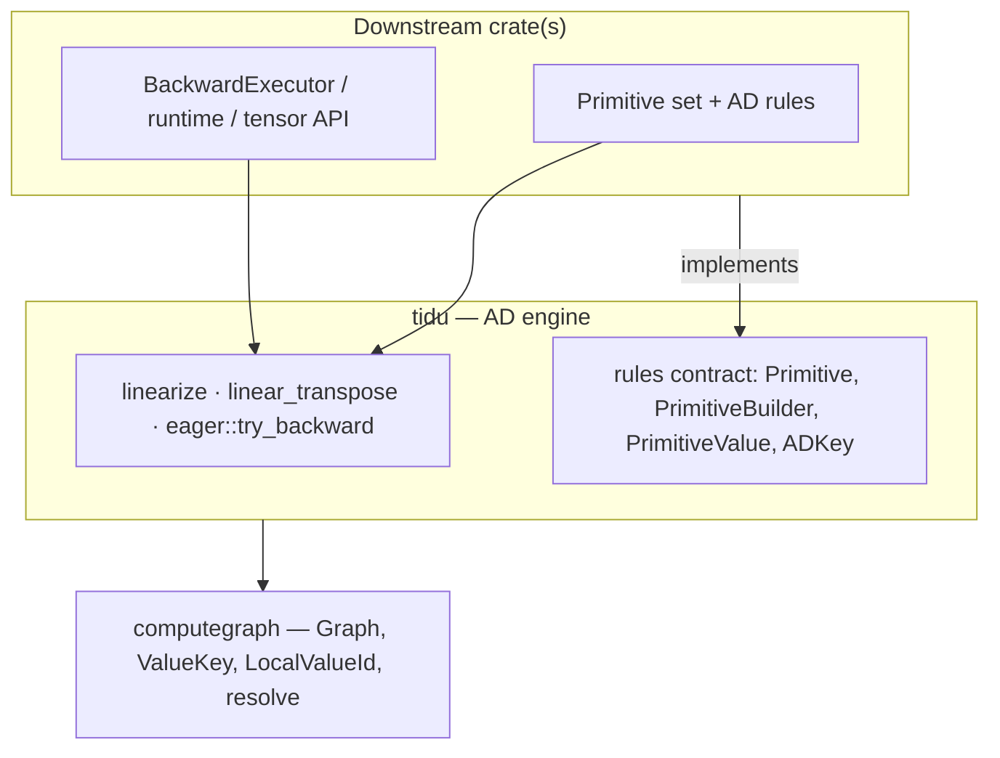
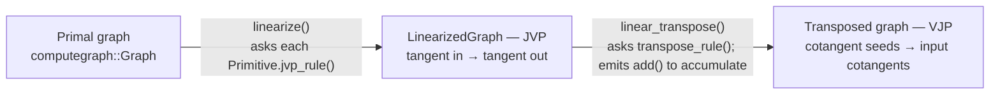
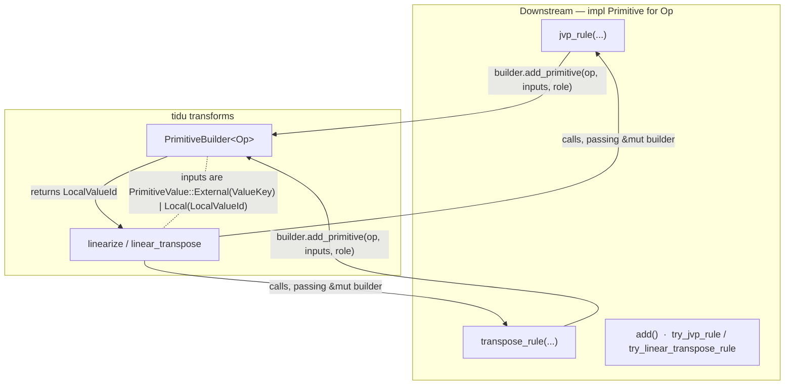

# tidu-rs Documentation: Release-Quality Improvement Design

Date: 2026-06-19
Status: Design approved; implementation plan pending.

## Goal

Raise the tidu-rs documentation to release quality for the `0.1.x` documentation-site
release hosted at <https://tensor4all.org/tidu-rs/>. The crate sets `publish = false`
and depends on `computegraph` through a pinned git revision, so crates.io publication
is explicitly out of scope. "Release" here means a polished documentation site plus a
version tag.

Two original requests motivate this work:

1. Verify the consistency between the online docs / README and the current implementation.
2. Improve the documentation toward release, especially with architecture diagrams.

## Consistency audit result (request #1)

A three-part audit (front-door + API reference, tutorials + guides examples, and
architecture + design + internals) cross-checked every docs page against the current
public API.

**Verdict: the docs are essentially consistent with the implementation.** Despite
recent high-churn commits (`Refactor public API around JAX terminology`,
`Update computegraph terminology`, `narrow eager API boundary`,
`Clarify docs-site front door`), the documentation tracked the API.

- No stale API names, broken signatures, or terminology drift were detected.
- Tutorial and guide code is snippet-sourced from `examples/*.rs`
  (`<!-- snippet-source: ... -->`) and matches the current API. CI runs
  `cargo test --examples` and `cargo test --doc`, so the example files compile.
- **One concrete gap:** `docs/api/index.md` (the Quarto "API Map") omits four exported
  types: `ADRuleError`, `ADRuleKind`, `ADRuleResult`, `DiffPassId`.

The remaining opportunities are about quality, not correctness:

- There are no architecture diagrams anywhere.
- Architecture and internals prose is accurate but thin: `ValueKey` identity,
  `OperationRole`, cotangent accumulation, the eager backward call sequence, and the
  `PrimitiveValue` distinction are under-explained.
- The front door (`docs/index.md`) does not link to the eager guide and does not surface
  the `tidu::eager` / `tidu::rules` public modules.
- (Noted, but out of scope) Snippet drift is unguarded: snippets are hand-copied from
  the example files with no CI check enforcing they stay in sync.

## Scope and approach (decided)

- **Scope: Medium** — diagrams, concept depth, front-door discoverability, and the
  API-map gap. This is deliberately *not* the minimal drift-fix, and *not* the full
  overhaul with CI guards and a README rewrite.
- **Approach B — Concepts hub page** — add one new Architecture Overview page near the
  front door that carries the headline diagrams and the system mental model, then
  distribute the remaining diagrams and deep-concept prose into their natural homes.

## Documentation build context

The site is built by `scripts/build_docs_site.sh` and deployed by
`.github/workflows/docs.yml` to GitHub Pages on push to `main`. The unified site
combines:

- Quarto-rendered project docs from `docs/` (driven by `docs/_quarto.yml`),
- rustdoc output (`cargo doc --workspace --no-deps`),
- a generated landing page.

CI installs Quarto, pandoc, and graphviz `dot`. **Quarto renders Mermaid and Graphviz
natively from fenced code blocks**, so every diagram in this design is authored as a
Mermaid block inside the relevant `.md` file — no new tooling is required.

Note: `docs/superpowers/**` is not in the `_quarto.yml` render list, so this design
document is not published to the site.

## Information architecture

**New page:** `docs/architecture/overview.md`, titled "How tidu Works".

- Placed as the first entry of the Architecture section in `docs/_quarto.yml`.
- Linked from the front door: `docs/index.md` ("Where To Start") and
  `docs/getting-started/index.md` both point here so a new reader can reach the
  whole-system mental model in one click.
- Content order: (1) tidu's responsibilities (what it owns vs. what it delegates,
  reusing the framing already in `index.md`) → (2) Layering diagram → (3)
  Transform-pipeline diagram → (4) a short narrative that links out to the deep pages.
  The Primitive/rule contract diagram also appears here, and is reused on
  `guides/implementing-primitives.md`.

**Deep-concept homes** (new sections added to existing pages):

| Concept | Page | Diagram |
|---|---|---|
| `ValueKey` identity / `PrimitiveValue` distinction | `guides/implementing-primitives.md` | ⑤ small |
| `OperationRole` | `guides/implementing-primitives.md` | ⑥ small |
| cotangent accumulation (`add` nodes) | `guides/linearize-and-transpose.md` | — |
| eager backward call sequence | `guides/eager-integration.md` | ④ sequence |
| tidu ↔ computegraph wrapper boundary | `architecture/computegraph-integration.md` | ③ |

## Diagram set

Five diagrams plus two small inline aids, all authored as Mermaid. The three core
diagrams that live on the Overview page are specified below; ③ and ④ are sketched here
and finalized as Mermaid during implementation.

### ❷ Layering (Overview)

### ❸ Transform pipeline (Overview)

### ② Primitive/rule contract (Overview + implementing-primitives)

### ③ computegraph wrapper boundary (computegraph-integration)

Containment diagram: `LinearizedGraph<Op>` and `PrimitiveGraph<'a, Op>` wrap
`computegraph::Graph<Op>`, exposing `as_graph()` / `into_graph()` / `tangent_inputs()`
/ `tangent_outputs()` while keeping storage private. Finalized as Mermaid during
implementation.

### ④ eager record → backward (eager-integration)

Sequence diagram across `Downstream`, `Recorder`, `tidu::eager::try_backward`, and
`BackwardExecutor`: `record_graph` produces a `Trace`; `try_backward` topologically
walks the trace, and per node linearizes + transposes the recorded graph, invoking the
executor's forward-replay / transposed-run / accumulate hooks, returning the cotangents
map. Finalized as Mermaid during implementation.

### ⑤ `ValueKey` taxonomy · ⑥ `OperationRole`

Small inline Mermaid or tables in their respective sections of
`guides/implementing-primitives.md`.

### Accuracy requirement (release blocker)

Every symbol name used in a diagram — `ValueKey` variants, `OperationRole` variants
(expected `Primary` / `Linearized { active_mask }`), `Recorder` / `Trace` /
`RecordedGraph` fields, and `BackwardExecutor` hook names — must be verified against
`src/` and the pinned `computegraph` source during implementation. A diagram that
misnames the API is a release blocker, not a cosmetic issue.

## Content additions

### Deep-concept sections

- `guides/implementing-primitives.md`:
  - **"Value reference model"** — `ValueKey` (`Input` vs `Derived { operation,
    output_slot }`, i.e. identity across graph boundaries) and the
    `PrimitiveValue::External(ValueKey)` vs `Local(LocalValueId)` distinction (External
    references an existing primal value; Local references a value the rule just emitted
    through the builder). Includes diagram ⑤.
  - **"Operation roles"** — `Primary` (primal) vs `Linearized { active_mask }`, what
    `active_mask` means, and why `transpose_rule` receives the role. Includes diagram ⑥.
- `guides/linearize-and-transpose.md`:
  - **"Cotangent accumulation"** — when one value feeds multiple consumers, multiple
    cotangents flow back and `linear_transpose` emits `Op::add()` nodes to sum them,
    shown with a minimal example.
- `guides/eager-integration.md`:
  - **"The backward call sequence"** — the concrete sequence: `Recorder::record_graph`
    → `EagerOutput` / `Trace` → (inside `try_backward`) topologically sort the trace →
    per node linearize + transpose → executor hooks (`execute_forward`,
    `run_transposed_linear`, `add_operands`) replay forward, run the transposed map, and
    accumulate → cotangents map. Includes diagram ④. Also documents the currently
    undocumented `EagerOutput.output_slot` field.

### Front door

`docs/index.md` and `docs/getting-started/index.md`: add a link to the Architecture
Overview, add a link to the eager guide, and name `tidu::eager` / `tidu::rules` as the
public-module entry points.

### API Map (`docs/api/index.md`)

Reorganize by module with a one-line description per item:

- **Transforms**: `linearize`, `try_linearize`, `linear_transpose`,
  `try_linear_transpose`, `try_linear_transpose_with_builder`, `LinearizedGraph`,
  `PrimitiveGraph`.
- **Rules**: `Primitive`, `PrimitiveBuilder`, `PrimitiveValue`, `ADKey`,
  **`ADRuleError`, `ADRuleKind`, `ADRuleResult`, `DiffPassId`** (the four missing items).
- **Eager**: `try_backward`, `BackwardExecutor`, `Recorder`, `RecordedGraph`,
  `EagerInput`, `EagerOutput`, `KeySource`, `Trace`.

### README

`README.md`: add a one-line link to the Architecture Overview alongside the existing
hosted-docs link. Optionally embed the pipeline diagram (GitHub renders Mermaid).

## Verification

- Run `bash scripts/build_docs_site.sh` locally (requires `quarto` and `graphviz`):
  confirm every Mermaid diagram renders without error and that there are no broken
  internal links. If `quarto` is not installed locally, fall back to verifying on the
  PR via `.github/workflows/docs.yml`.
- Cross-check every diagram symbol name against `src/` and the pinned `computegraph`
  source (see Accuracy requirement).
- This is a docs-only change. If any `///` doc comment or example file is touched, re-run
  `cargo test --doc --release` and `cargo test --examples --release`.
- There is no automated Mermaid or link checker; verification is a local build plus
  visual review. Adding such a guard is explicitly out of scope (it belongs to the
  larger scope we declined).

## Non-goals

- A snippet-sync CI guard (larger scope).
- Sidebar restructuring or a new "Concepts" section (that was approach C).
- crates.io publication prep, a full README rewrite, or new tutorials.
- Any change to the `src/` public API.
- A thorough rustdoc `///` pass — left as a follow-up.

## File-by-file change list

- **New** `docs/architecture/overview.md` — the concepts hub (diagrams ❷ ❸ ②).
- **Edit** `docs/_quarto.yml` — add `overview.md` as the first Architecture entry.
- **Edit** `docs/index.md` — front-door links (Overview, eager guide, public modules).
- **Edit** `docs/getting-started/index.md` — front-door links.
- **Edit** `docs/api/index.md` — add the four missing types; module-grouped one-liners.
- **Edit** `docs/guides/implementing-primitives.md` — value reference model + operation
  roles sections (diagrams ⑤ ⑥); contract diagram ② reused.
- **Edit** `docs/guides/linearize-and-transpose.md` — cotangent accumulation section.
- **Edit** `docs/guides/eager-integration.md` — backward call sequence section
  (diagram ④); document `EagerOutput.output_slot`.
- **Edit** `docs/architecture/computegraph-integration.md` — wrapper boundary diagram ③.
- **Edit** `README.md` — Overview link (optional pipeline diagram).

## Success criteria

- `bash scripts/build_docs_site.sh` renders without error; all Mermaid diagrams display;
  no broken internal links.
- The four previously missing types appear in the API Map.
- A new reader reaches a whole-system mental model from the front door in one click
  (the Overview page).
- Every diagram symbol name is verified against source.
- The five deep-concept sections exist and are accurate.
